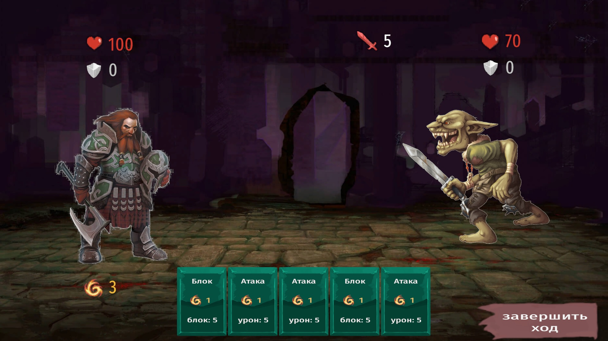

# 🃏 Card Dungeon

> Пошаговый карточный рогалик на Unity (C#)

---

## Описание

**Card Dungeon** — roguelike deckbuilder в стиле *Slay the Spire*. Игрок проходит процедурно сгенерированную карту подземелья из 10 комнат, сражается с врагами с помощью колоды карт, собирает баффы и пытается победить финального босса. После победы доступен **бесконечный режим** с экспоненциально возрастающей сложностью.

---

## Технологии

| | |
|---|---|
| Движок | Unity (URP) |
| Язык | C# |
| Разрешение | 1920×1080 |
| Платформа | PC |

---

## Геймплей

### 🗺️ Карта подземелья
Карта процедурно генерируется при каждом новом забеге и состоит из 10 колонок:

```
[Старт] → [Враг/Лечение] x3 → [Элита] → [Враг/Лечение] x3 → [Элита] → [Босс]
```

### ⚔️ Боевая система
- Пошаговый бой: **игрок → враг → игрок → ...**
- Каждый ход: **3 энергии** и **5 карт** в руку
- Карта разыгрывается нажатием; рука сбрасывается в конце хода
- Враг заранее показывает своё **намерение** (иконка + текст)

### 🃏 Типы карт

| Карта | Стоимость | Эффект | Улучшение |
|-------|-----------|--------|-----------|
| Атака | 1 | Урон врагу | Атака+ (больше урона) |
| Блок | 1 | Поглощение урона | Блок+ |
| Безрассудная атака | 1 | Урон врагу + 5 урона себе | Безрассудная+ |
| Яд | 2 | 5 стака яда на врага | Яд+ |
| Оглушение | 2 | Оглушение врага на 2 хода | Оглушение+ |

### 🧪 Статусные эффекты

- **Яд** — в начале хода наносит урон = текущим стакам, затем стаки −1. Применяется к обеим сторонам.
- **Оглушение** — враг пропускает 2 хода.
- **Блок** — поглощает входящий урон; сбрасывается в начале хода владельца.

### 🎯 Намерения врагов

| Намерение | Действие |
|-----------|----------|
| Attack | Одиночная атака |
| DoubleAttack | Двойная атака |
| Block | +8 блока, −1 яд |
| BuffSelf | Постоянный бонус к урону |
| PoisonPlayer | +4 стака яда игроку |

---

## Прогрессия

### ✨ Баффы (награда за элиту)
После победы над элитным врагом игрок выбирает один из 3 случайных постоянных баффов:

| Бафф | Эффект |
|------|--------|
| BonusBlock | +4 блока в начале каждого хода |
| BonusAttack | +3 к урону всех атак |
| ExtraEnergy | +1 энергия каждый ход |
| BonusMaxHP | +15 макс. HP |
| Thorns | Враг получает 2 урона при атаке |
| Regeneration | +3 HP в начале каждого хода |
| ExtraCard | +1 карта в руку каждый ход |
| Berserk | +1 энергия при получении урона |

### 📦 Награды после обычного боя
Выбор между:
- **Улучшить карту** — выбрать из до 3 карт колоды для апгрейда (версия `+`)
- **Новая карта** — выбрать из до 3 случайных карт пула наград
- **Пропустить** — вернуться на карту без выбора

---

## Бесконечный режим

После победы над боссом можно продолжить в **Endless Mode**:
- Колода, баффы и HP сохраняются
- Генерируется новая карта подземелья
- Характеристики всех врагов умножаются на `2^N`, где `N` — номер прохождения

```
Забег 1: ×2   |   Забег 2: ×4   |   Забег 3: ×8   |   ...
```

---

## Демонстрация

Видео с демонстрацией геймплея:
- https://vkvideo.ru/video-239235224_456239017




---

## Структура проекта

```
Assets/
├── Data/
│   ├── Cards/          # ScriptableObject ассеты карт
│   └── Enemies/        # ScriptableObject ассеты врагов
├── Scenes/
│   ├── MapScene
│   ├── BattleScene
│   ├── RewardScene
│   ├── VictoryScene
│   └── GameOverScene
└── Skript/
    ├── GameManager.cs      # Глобальное состояние, навигация между сценами
    ├── BattleManager.cs    # Координация боя
    ├── DeckManager.cs      # Колода: drawPile / hand / discardPile
    ├── TurnManager.cs      # Управление ходами
    ├── MapGenerator.cs     # Процедурная генерация карты
    ├── MapUI.cs            # Отрисовка и взаимодействие с картой
    ├── UpgradeManager.cs   # Пул наград и улучшений
    ├── Player.cs           # Состояние игрока в бою
    ├── Enemy.cs            # Поведение и намерения врага
    ├── Card.cs / CardData.cs   # Логика и данные карты
    ├── EnemyData.cs        # Данные врага (ScriptableObject)
    ├── RewardUI.cs         # Интерфейс выбора награды
    ├── BattleUI.cs         # Интерфейс боевой сцены
    └── EndlessButton.cs    # Кнопка запуска бесконечного режима
```

---

## Запуск

1. Открыть проект в **Unity** (URP)
2. Открыть сцену `StartScene` как стартовую
3. Нажать **Play**

> При смерти игрока весь прогресс текущего забега сбрасывается автоматически.

---

## Архитектура

`GameManager` реализован как синглтон (`DontDestroyOnLoad`) и хранит состояние между сценами: HP, колода, активные баффы, текущий узел карты, флаг бесконечного режима.

Каждая игровая система изолирована в отдельном скрипте. Данные карт и врагов хранятся в **ScriptableObject**-ассетах — это позволяет легко добавлять новый контент через инспектор Unity без изменения кода.
